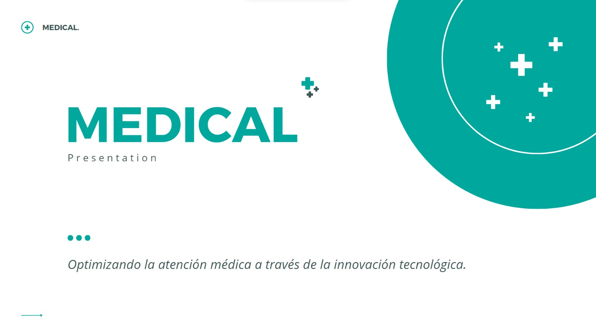

# SoftMedical 🩺
Este proyecto es una aplicación de gestión de pacientes diseñada para facilitar la administración de información de pacientes, citas médicas y personal médico en un entorno de atención médica. 

## Características Principales 💉
Registro de pacientes con información detallada. ✅
Modificar información de pacientes. ✅
Programación y gestión de citas médicas. ✅
Búsqueda y filtrado de pacientes por nombre.  ✅ 
Generación de informes y estadísticas básicas. 

### Mejoras 📈
• Buscar pacientes por número de identificación registrado  ✅
• Agregar lista de especialidades del centro medico ✅
• Buscar fechas y horarios disponibles, teniendo en cuenta la especialidad  ✅
•Completar los except faltantes ✅
•contol de pacientes al solicitar cita medica ✅
•validar el formato de las fechas  ✅

---
### Presentación 🩺
https://www.canva.com/design/DAFywGjyZQs/VgHIV8omJApMCUpM-iWCHg/edit?utm_content=DAFywGjyZQs&utm_campaign=designshare&utm_medium=link2&utm_source=sharebutton
